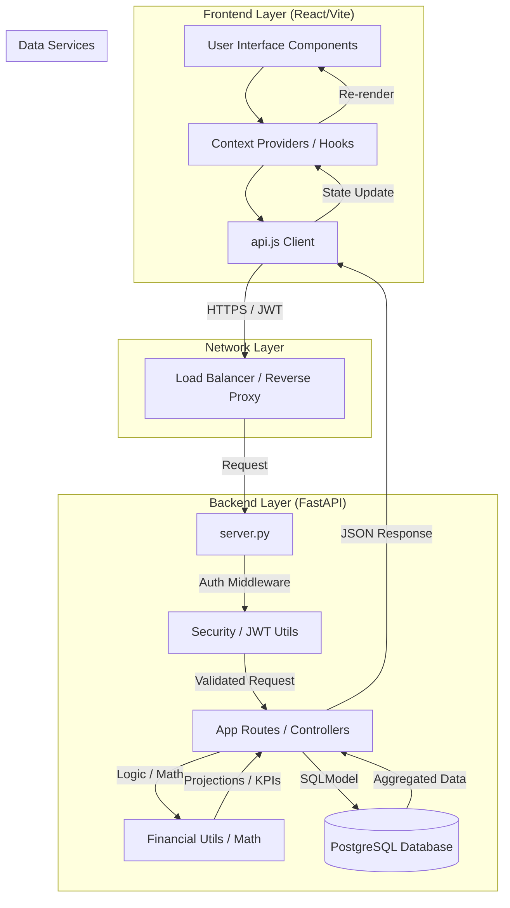
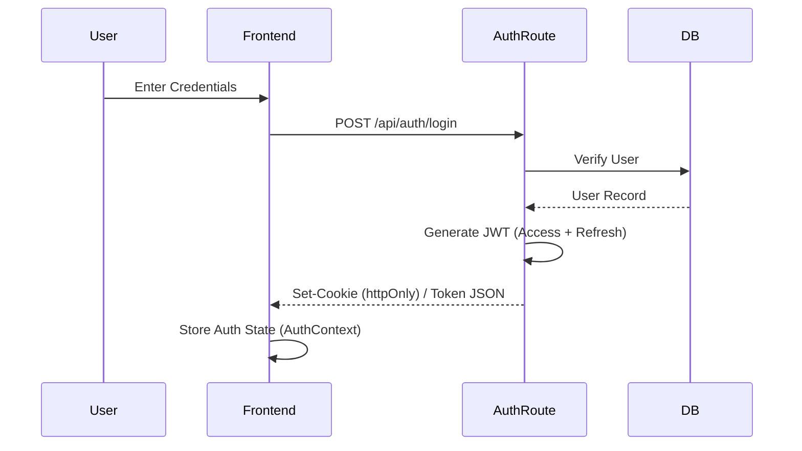
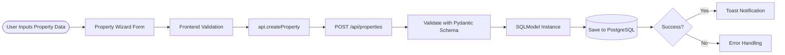
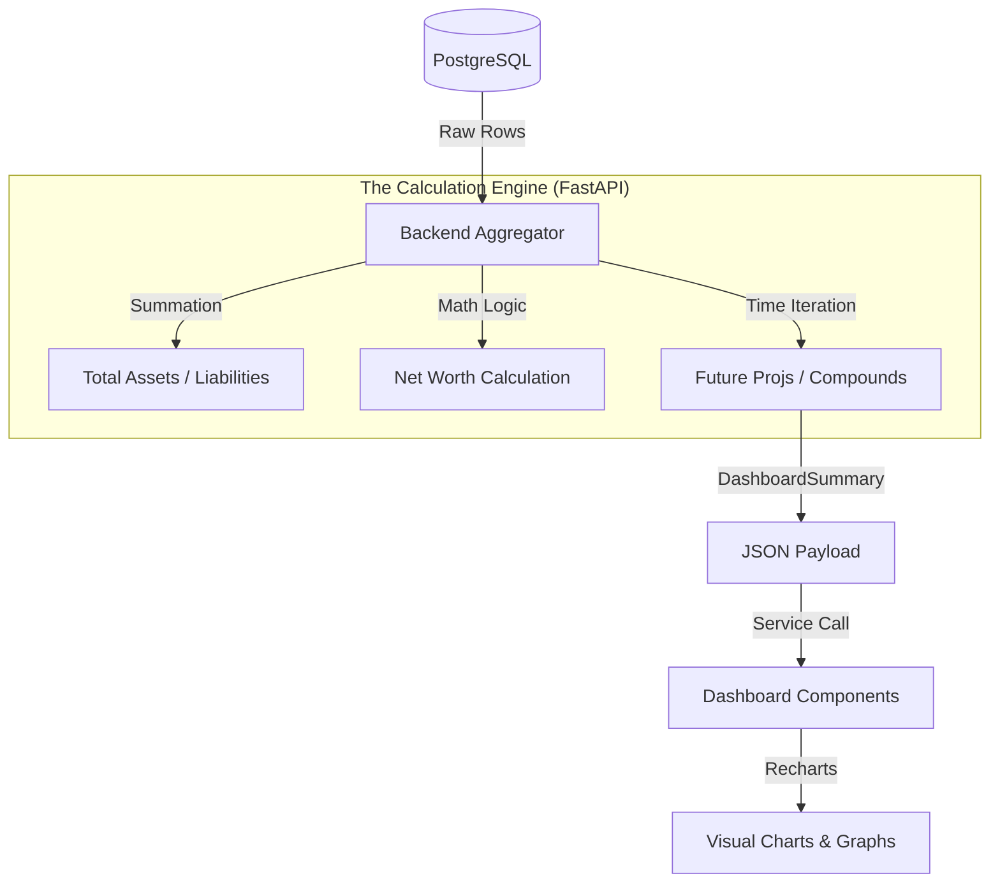

# Propequitylab Codebase Data Flow Map 🗺️

This document provides a comprehensive end-to-end visual map of the Propequitylab codebase, illustrating how data flows through various layers of the application.

## 1. End-To-End Application Architecture

The following diagram shows the high-level flow from User Interaction to Database Persistence and back to the Frontend for visualization.

---

## 2. Specific Data Cycles

### A. Authentication & Security Flow
How we ensure only the right eyes see the right data.

### B. Portfolio & Property CRUD Lifecycle
The core journey of financial data.

### C. Financial Projection & Dashboard Aggregation
How raw numbers become insights.

---

## 3. Core Component Mapping

| Layer | Responsibility | Key Files / Folders |
| :--- | :--- | :--- |
| **API Entry** | Application configuration & Security | `backend/server.py` |
| **Data Models** | Database schemas (SQLModel) | `backend/models/` |
| **Business Logic**| API Endpoints & CRUD operations | `backend/routes/` |
| **Financial Logic**| Interest rates, projections, math | `backend/utils/calculations.py` |
| **Frontend Core** | Application shell & Routing | `frontend/src/App.js` |
| **State Management**| Portfolio & Auth contexts | `frontend/src/context/` |
| **API Integration**| Axios client & centralized methods | `frontend/src/services/api.js` |
| **UI Kit** | Reusable Shadcn/custom components | `frontend/src/components/ui/` |

---

## 4. Key Data Models

Each user owns one or more **Portfolios**. 
Each **Portfolio** contains multiple entities:
- **Properties**: Purchase price, value, location.
- **Loans**: Linked to properties, interest rates.
- **Assets/Liabilities**: Cash, shares, other debts.
- **Income/Expenses**: Salary, rental yield vs maintenance, lifestyle.
- **Financial Plans**: Future scenarios and target outcomes.

---

> [!TIP]
> **Pro-Tip for Developers:** When adding a new feature, follow this flow:
> 1. Define the `SQLModel` in `backend/models/`.
> 2. Create the route in `backend/routes/`.
> 3. Add the API method in `frontend/src/services/api.js`.
> 4. Create the UI component in `frontend/src/components/`.
