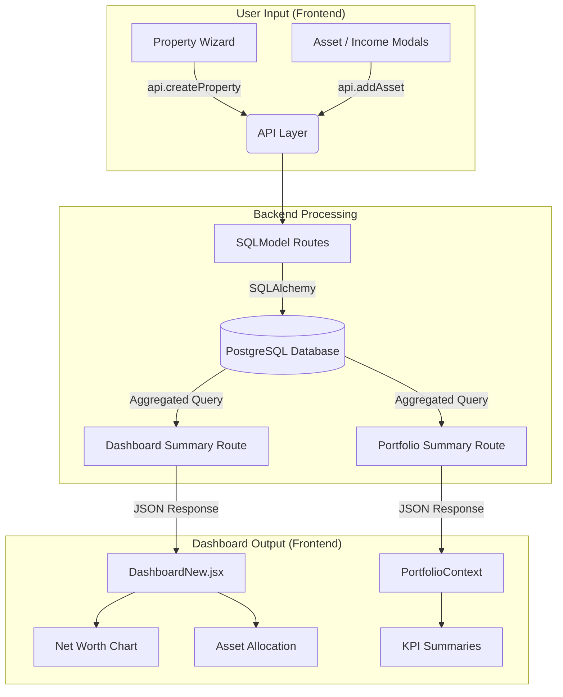

# Dashboard Data Flow Guide 📊

This guide explains how data is created, processed, and visualized within PropEquityLab. It shows the journey from a user adding a property to seeing its impact on their Net Worth dashboard.

## 1. Visual Data Flow

---

## 2. Technical Breakdown

### Data Creation (The Source)
When you add a property via the **"Add Property"** button, the following happens:
1.  **Frontend:** `PropertyFormModal` collects the data and sends a POST request to `/api/properties`.
2.  **Backend:** `server.py` receives the request and routes it to `properties.py`.
3.  **Persistence:** The data is validated and saved as a new row in the `Property` table in PostgreSQL.

### Data Aggregation (The Engine)
The Dashboard does not just show "raw" rows; it calculates your financial health in real-time:
1.  **Dashboard API:** When the dashboard loads, it calls `/api/dashboard/summary`.
2.  **Summation:** The backend SQL query fetches all properties, assets, and liabilities belonging to you.
3.  **Calculations:**
    *   `Net Worth = (Property Value + Cash + Assets) - (Loans + Liabilities)`
    *   `Cashflow = (Rental Income + Salary) - (Expenses + Loan Repayments)`
4.  **Efficiency:** These calculations are performed on the fly, ensuring your dashboard is always a 1:1 reflection of your current data.

### Data Visualization (The Output)
Finally, the JSON data is consumed by the frontend:
- **KPI Cards:** Show top-level numbers like "Total Assets" and "Monthly Cashflow".
- **Charts:** Use `Recharts` to render the `AssetBreakdown` (Properties vs Super vs Shares) and historical `Net Worth` trends.

---

## 3. How to Verify Updates
1.  Go to the **Properties** side menu.
2.  Add a property with a specific value (e.g., $500,000).
3.  Return to the **Dashboard**.
4.  Verify that your **Net Worth** and **Total Assets** have increased by exactly that amount.
