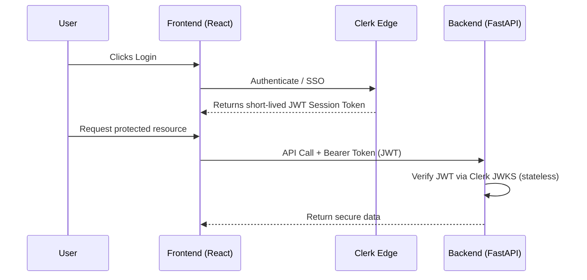

# Clerk Integration Guide — PropEquityLab

**Date:** March 2026
**Subject:** Authentication Migration to Clerk
**Stack:** React 19 (CRA/CRACO) + FastAPI + PostgreSQL (Neon)

> **Read first:** This guide is a companion to [`docs/plans/clerk-stripe-implementation-plan.md`](./plans/clerk-stripe-implementation-plan.md), which defines the full phased rollout (data model changes, Stripe billing, entitlements, user migration). This guide focuses on the Clerk-specific wiring steps.

---

## 1. Architecture



The backend does **not** use the Clerk SDK — it only verifies the JWT against Clerk's public JWKS endpoint. No Clerk secret key is needed for standard request verification.

---

## 2. Clerk Dashboard Setup

1. Go to [Clerk Dashboard](https://dashboard.clerk.com) → create a new application.
2. Enable Email/Password and any OAuth providers (Google, Microsoft, etc.).
3. Navigate to **API Keys** and copy:
   - **Publishable Key** → used in React frontend
   - **Secret Key** → stored in backend env (used for admin/webhook operations only)
4. Note your **Issuer URL** (e.g. `https://your-app.clerk.accounts.dev`) — needed for backend JWKS verification.

---

## 3. Frontend Integration

### 3.1 Install

From the `frontend/` directory:

```bash
npm install @clerk/clerk-react
```

### 3.2 Environment variables

Add to `frontend/.env` and `frontend/.env.example`:

```env
REACT_APP_CLERK_PUBLISHABLE_KEY=pk_test_...
```

### 3.3 Add ClerkProvider to App.js

`ClerkProvider` wraps **inside** `ThemeProvider` and **outside** `AuthProvider`, preserving the existing provider order:

```jsx
// frontend/src/App.js

import { ClerkProvider } from "@clerk/clerk-react";

const PUBLISHABLE_KEY = process.env.REACT_APP_CLERK_PUBLISHABLE_KEY;
if (!PUBLISHABLE_KEY) {
  throw new Error("Missing REACT_APP_CLERK_PUBLISHABLE_KEY");
}

// Existing provider chain — ClerkProvider added between ThemeProvider and AuthProvider:
//   BrowserRouter
//     ThemeProvider
//       ClerkProvider        <-- NEW
//         Sentry.ErrorBoundary
//           HelmetProvider
//             AuthProvider
//               UserProvider
//                 PortfolioProvider

function App() {
  return (
    <BrowserRouter>
      <ThemeProvider>
        <ClerkProvider publishableKey={PUBLISHABLE_KEY}>
          <Sentry.ErrorBoundary>
            <HelmetProvider>
              <AuthProvider>
                <UserProvider>
                  <PortfolioProvider>
                    {/* app routes */}
                  </PortfolioProvider>
                </UserProvider>
              </AuthProvider>
            </HelmetProvider>
          </Sentry.ErrorBoundary>
        </ClerkProvider>
      </ThemeProvider>
    </BrowserRouter>
  );
}
```

### 3.4 Replace custom auth pages with Clerk components

During migration, swap out the existing login/register pages with Clerk's prebuilt components (fastest path). The existing page files to replace:

- `frontend/src/pages/Login.jsx`
- `frontend/src/pages/Register.jsx`
- `frontend/src/pages/ForgotPassword.jsx`
- `frontend/src/pages/ResetPassword.jsx`
- `frontend/src/pages/VerifyEmail.jsx`

Example for `Login.jsx`:

```jsx
// frontend/src/pages/Login.jsx
import { SignIn } from "@clerk/clerk-react";

export default function Login() {
  return (
    <div className="flex items-center justify-center min-h-screen bg-background">
      <SignIn routing="path" path="/login" afterSignInUrl="/dashboard" />
    </div>
  );
}
```

Example for nav bar signed-in/out state:

```jsx
import { SignedIn, SignedOut, SignInButton, UserButton } from "@clerk/clerk-react";

export function NavBar() {
  return (
    <nav>
      <SignedOut>
        <SignInButton mode="modal" />
      </SignedOut>
      <SignedIn>
        <UserButton afterSignOutUrl="/" />
      </SignedIn>
    </nav>
  );
}
```

### 3.5 Update AuthContext to use Clerk

`AuthContext` becomes a thin adapter over Clerk's hooks. This preserves the `useAuth()` interface consumed by the rest of the app:

```jsx
// frontend/src/context/AuthContext.jsx
import { createContext, useContext } from "react";
import { useUser, useClerk } from "@clerk/clerk-react";

const AuthContext = createContext(null);

export function AuthProvider({ children }) {
  const { user, isLoaded } = useUser();
  const { signOut } = useClerk();

  const value = {
    user: user ? { id: user.id, email: user.primaryEmailAddress?.emailAddress, name: user.fullName } : null,
    isAuthenticated: !!user,
    loading: !isLoaded,
    logout: () => signOut(),
  };

  return <AuthContext.Provider value={value}>{children}</AuthContext.Provider>;
}

export const useAuth = () => useContext(AuthContext);
```

### 3.6 Update api.js to inject Clerk tokens

**Do not** create ad-hoc axios instances for auth. Modify the **existing** `frontend/src/services/api.js` request interceptor to get the token from Clerk's session instead of `localStorage`.

Because `api.js` is a plain module (not a React component), use Clerk's `getToken` function via a module-level setter called from the app root:

```jsx
// frontend/src/services/api.js

// Add a module-level token getter (replaces localStorage access)
let getClerkToken = null;

export function setClerkTokenGetter(fn) {
  getClerkToken = fn;
}

// Update the existing request interceptor:
apiClient.interceptors.request.use(
  async (config) => {
    const token = getClerkToken ? await getClerkToken() : null;
    if (token) {
      config.headers.Authorization = `Bearer ${token}`;
    }
    return config;
  },
  (error) => Promise.reject(error)
);
```

Then wire it up in `App.js` using the `useAuth` hook from Clerk:

```jsx
// frontend/src/App.js (inside a component that is a child of ClerkProvider)
import { useAuth } from "@clerk/clerk-react";
import { setClerkTokenGetter } from "./services/api";

function ClerkTokenBridge() {
  const { getToken } = useAuth();
  setClerkTokenGetter(getToken);
  return null;
}

// Place <ClerkTokenBridge /> inside ClerkProvider, before AuthProvider
```

Also remove the token-refresh queue logic from `api.js` response interceptor — Clerk manages session refresh automatically. The 401 handler can simplify to redirecting to login if Clerk reports no active session.

---

## 4. Backend Integration

### 4.1 Install dependency

Add to `backend/requirements.txt`:

```txt
pyjwt[crypto]>=2.8.0
```

```bash
pip install -r requirements.txt
```

### 4.2 Environment variables

Add to `backend/.env` and `backend/.env.example`:

```env
CLERK_JWKS_URL=https://your-app.clerk.accounts.dev/.well-known/jwks.json
CLERK_ISSUER=https://your-app.clerk.accounts.dev
```

> **Do not** overwrite `backend/utils/auth.py` — it contains the existing JWT utilities still needed during the transition window. Create a **new** file alongside it.

### 4.3 Create backend/utils/clerk_auth.py

```python
"""
Clerk JWT verification dependency.

Used alongside the existing auth.py during migration.
Replaces auth.py's get_current_user once all routes are migrated.
"""

import os
import logging
import jwt
from fastapi import Depends, HTTPException, status
from fastapi.security import HTTPBearer, HTTPAuthorizationCredentials
from sqlmodel import Session, select

from models.user import User
from utils.database_sql import get_session

logger = logging.getLogger(__name__)

security = HTTPBearer()

CLERK_JWKS_URL = os.getenv("CLERK_JWKS_URL")
CLERK_ISSUER = os.getenv("CLERK_ISSUER")

# Module-level singleton — caches public keys for 1 hour to avoid JWKS rate limits
_jwks_client = None

def _get_jwks_client() -> jwt.PyJWKClient:
    global _jwks_client
    if _jwks_client is None:
        _jwks_client = jwt.PyJWKClient(CLERK_JWKS_URL, cache_keys=True, lifespan=3600)
    return _jwks_client


def verify_clerk_token(
    credentials: HTTPAuthorizationCredentials = Depends(security),
) -> dict:
    """Verify a Clerk-issued JWT and return the decoded payload."""
    token = credentials.credentials
    try:
        jwks_client = _get_jwks_client()
        signing_key = jwks_client.get_signing_key_from_jwt(token)
        payload = jwt.decode(
            token,
            signing_key.key,
            algorithms=["RS256"],
            issuer=CLERK_ISSUER,
            # Validate azp (authorized party) to ensure token is for this app
            options={"verify_aud": False},
        )
        return payload
    except jwt.ExpiredSignatureError:
        raise HTTPException(status_code=status.HTTP_401_UNAUTHORIZED, detail="Token has expired")
    except Exception:
        logger.exception("Clerk token verification failed")
        raise HTTPException(status_code=status.HTTP_401_UNAUTHORIZED, detail="Could not validate credentials")


def get_current_user_clerk(
    payload: dict = Depends(verify_clerk_token),
    session: Session = Depends(get_session),
) -> User:
    """
    Resolve a verified Clerk JWT to a local User record.

    The JWT 'sub' claim contains the Clerk user ID (e.g. 'user_2abc...').
    This is mapped to User.clerk_user_id, NOT User.id (which is an internal UUID).

    On first sign-in after migration, creates the local User record if absent
    (soft migration — see Phase 9 of the implementation plan).
    """
    clerk_user_id = payload.get("sub")
    if not clerk_user_id:
        raise HTTPException(status_code=status.HTTP_401_UNAUTHORIZED, detail="Invalid token subject")

    user = session.exec(
        select(User).where(User.clerk_user_id == clerk_user_id)
    ).first()

    if not user:
        # Attempt email-based match for existing users migrating for the first time
        email = payload.get("email")
        if email:
            user = session.exec(select(User).where(User.email == email)).first()
            if user:
                user.clerk_user_id = clerk_user_id
                session.add(user)
                session.commit()
                session.refresh(user)

    if not user:
        raise HTTPException(status_code=status.HTTP_404_NOT_FOUND, detail="User not found")

    return user
```

### 4.4 Use the new dependency in routes

Replace `get_current_user` (from `auth.py`) with `get_current_user_clerk` (from `clerk_auth.py`) one route file at a time. The function signature is identical — drop-in replacement:

```python
# backend/routes/portfolios.py
from fastapi import APIRouter, Depends
from utils.clerk_auth import get_current_user_clerk
from models.user import User

router = APIRouter(prefix="/portfolios", tags=["portfolios"])

@router.get("/")
def get_portfolios(
    current_user: User = Depends(get_current_user_clerk),
    session: Session = Depends(get_session),
):
    # Data isolation: always filter by current_user.id (internal UUID)
    portfolios = session.exec(
        select(Portfolio).where(Portfolio.user_id == current_user.id)
    ).all()
    return portfolios
```

> **IMPORTANT:** Always use `current_user.id` (internal UUID) for all DB queries — never `clerk_user_id` directly. The IDOR protection rule in CLAUDE.md applies unchanged.

---

## 5. Data Model Change Required

Before deploying the backend changes, add `clerk_user_id` to the User model and run a migration:

```python
# backend/models/user.py — add this field to the User table
clerk_user_id: Optional[str] = Field(default=None, unique=True, index=True, max_length=50)
```

Generate and apply the migration:

```bash
cd backend
alembic revision --autogenerate -m "add clerk_user_id to users"
alembic upgrade head
```

---

## 6. Existing User Migration

**Do not** force existing users to reset their passwords. Use soft migration (see Phase 9 of the implementation plan):

1. User signs in with Clerk using their existing email.
2. `get_current_user_clerk` in `clerk_auth.py` matches by email → saves `clerk_user_id`.
3. All portfolio data, property records, and settings are preserved — linked via `User.id` (unchanged).
4. Once `clerk_user_id` is populated for all users, the old `password_hash` / `verification_token` / `reset_token` columns can be dropped in a follow-up migration.

---

## 7. Deployment & Operations

**Environment hygiene:**
- `REACT_APP_CLERK_PUBLISHABLE_KEY` → Cloudflare Pages environment variables
- `CLERK_JWKS_URL` + `CLERK_ISSUER` → AWS Secrets Manager / App Runner environment variables
- Never commit `.env` files

**JWKS caching:**
- The module-level `_jwks_client` singleton in `clerk_auth.py` caches public keys for 1 hour.
- This avoids JWKS endpoint rate limits and eliminates per-request network calls.

**CSP/CORS:**
- Update `backend/server.py` CORS config to include Clerk's domain if any server-side Clerk calls are made.
- Update Content-Security-Policy `connect-src` to allow `*.clerk.accounts.dev` and `*.stripe.com`.

**Error boundaries:**
- The existing `Sentry.ErrorBoundary` in `App.js` will catch Clerk auth failures.
- Ensure the 401 response interceptor in `api.js` redirects to `/login` cleanly when Clerk reports no active session.

---

## 8. Rollout Sequence

Follow the phased plan in `clerk-stripe-implementation-plan.md`. For auth specifically:

1. Apply DB migration (`clerk_user_id` column)
2. Deploy `clerk_auth.py` to backend
3. Migrate routes one file at a time — starting with lowest-risk endpoints
4. Update frontend: add `ClerkProvider`, update `AuthContext`, update `api.js`
5. Replace auth pages with Clerk components
6. Validate soft migration path with test accounts
7. Deprecate old `auth.py` endpoints once all routes are migrated and `clerk_user_id` is populated for all users
