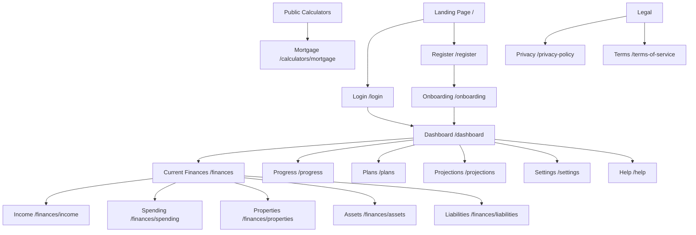

# PropEquityLab - Full Website Functionality Schema

> **Purpose**: Complete mapping of all pages, buttons, navigation, and API endpoints needed for a production-ready property investment platform.

---

## 🔍 Current State Summary

| Area | Status | Notes |
|------|--------|-------|
| **Frontend UI** | ✅ Healthy | 15 pages, 107 components built |
| **Backend API** | ❌ Broken | Returning 404 on all endpoints |
| **Authentication** | ⚠️ Dev Mode | Bypassed - no real auth |
| **DNS** | ⚠️ Issue | `pages.dev` not resolving |

---

## 🗺️ Site Map & Navigation Structure



---

## 📄 Page-by-Page Functionality Schema

### 1. Landing Page (`/`)
| Element | Type | Functionality | Status |
|---------|------|---------------|--------|
| Hero CTA "Get Started" | Button | → `/register` | ✅ Working |
| "Login" link | Link | → `/login` | ✅ Working |
| Feature sections | Display | Marketing content | ✅ Working |
| Calculator link | Link | → `/calculators/mortgage` | ✅ Working |

---

### 2. Authentication Pages

#### 2.1 Login (`/login`)
| Element | Type | API Endpoint | Status |
|---------|------|--------------|--------|
| Email input | Form Field | — | ✅ UI Ready |
| Password input | Form Field | — | ✅ UI Ready |
| "Login" button | Submit | `POST /api/auth/login` | ❌ API 404 |
| "Forgot Password" link | Link | → `/forgot-password` | ❌ Not Implemented |
| "Register" link | Link | → `/register` | ✅ Working |
| Google OAuth | Button | `POST /api/auth/google` | ❌ Not Implemented |

**Required Backend Endpoints:**
```
POST /api/auth/login          { email, password } → { access_token, refresh_token, user }
POST /api/auth/refresh        { refresh_token } → { access_token }
POST /api/auth/forgot-password { email } → { message }
POST /api/auth/reset-password  { token, password } → { message }
POST /api/auth/google         { token } → { access_token, user }
```

#### 2.2 Register (`/register`)
| Element | Type | API Endpoint | Status |
|---------|------|--------------|--------|
| Full name input | Form Field | — | ✅ UI Ready |
| Email input | Form Field | — | ✅ UI Ready |
| Password input | Form Field | — | ✅ UI Ready |
| Confirm password | Form Field | — | ✅ UI Ready |
| "Create Account" button | Submit | `POST /api/auth/register` | ❌ API 404 |
| Terms checkbox | Checkbox | — | ✅ UI Ready |
| "Login" link | Link | → `/login` | ✅ Working |

**Required Backend Endpoints:**
```
POST /api/auth/register       { email, password, name } → { access_token, refresh_token, user }
POST /api/auth/verify-email   { token } → { verified: true }
POST /api/auth/resend-verification { email } → { message }
```

---

### 3. Onboarding Wizard (`/onboarding`)
| Step | Elements | API Endpoints | Status |
|------|----------|---------------|--------|
| Step 1: Profile | Name, DOB, Goals | `GET /api/onboarding/status` | ❌ API 404 |
| Step 2: Income | Primary income entry | `POST /api/income` | ❌ API 404 |
| Step 3: Properties | Add first property | `POST /api/properties` | ❌ API 404 |
| Step 4: Goals | Financial targets | `PUT /api/users/goals` | ❌ Not Implemented |
| Skip button | Navigation | `POST /api/onboarding/skip` | ❌ API 404 |
| Complete button | Submit | `POST /api/onboarding/complete` | ❌ API 404 |

**Required Backend Endpoints:**
```
GET  /api/onboarding/status   → { completed, current_step, progress }
POST /api/onboarding/skip     → { completed: true }
POST /api/onboarding/complete → { completed: true }
POST /api/onboarding/reset    → { completed: false, current_step: 1 }
```

---

### 4. Dashboard (`/dashboard`)
| Element | Type | API Endpoint | Status |
|---------|------|--------------|--------|
| Net Worth display | Data Widget | `GET /api/dashboard/summary` | ❌ API 404 |
| Net Worth chart | Chart | `GET /api/dashboard/net-worth-history` | ❌ Not Implemented |
| Total Assets card | Data Widget | `GET /api/dashboard/summary` | ❌ API 404 |
| Total Liabilities card | Data Widget | `GET /api/dashboard/summary` | ❌ API 404 |
| Monthly Cash Flow | Data Widget | `GET /api/dashboard/summary` | ❌ API 404 |
| Portfolio selector | Dropdown | `GET /api/portfolios` | ❌ API 404 |
| "Create Portfolio" button | Modal Trigger | `POST /api/portfolios` | ❌ API 404 |
| "Create Snapshot" button | Action | `POST /api/dashboard/snapshot` | ❌ Not Implemented |
| Right Panel: Projection Scenarios | Widget | `GET /api/projections/scenarios` | ❌ Not Implemented |
| Quick Settings sliders | Controls | Local state + refresh | ✅ UI Ready |

**Required Backend Endpoints:**
```
GET  /api/dashboard/summary           → { net_worth, assets, liabilities, cash_flow }
GET  /api/dashboard/net-worth-history → [{ date, value }]
POST /api/dashboard/snapshot          → { snapshot_id, created_at }
GET  /api/portfolios                  → [{ id, name, type }]
POST /api/portfolios                  { name, type } → { id, name }
```

---

### 5. Current Finances - Income (`/finances/income`)
| Element | Type | API Endpoint | Status |
|---------|------|--------------|--------|
| "Add Income" button | Modal Trigger | — | ✅ UI Ready |
| Income list | Data Display | `GET /api/income` | ❌ API 404 |
| Total Income summary | Calculated | From list | ✅ Logic Ready |
| Edit income button | Modal Trigger | — | ✅ UI Ready |
| Delete income button | Confirm Dialog | `DELETE /api/income/:id` | ❌ API 404 |
| Income form submit | Modal Submit | `POST/PUT /api/income` | ❌ API 404 |
| Filter by type | Dropdown | Local filter | ✅ Working |

**Income Types Required:**
- Salary/Wages
- Rental Income
- Business Income
- Dividends
- Interest
- Other

**Required Backend Endpoints:**
```
GET    /api/income                        → [{ id, name, amount, frequency, type, start_date }]
POST   /api/income         { data }       → { id, ... }
PUT    /api/income/:id     { data }       → { id, ... }
DELETE /api/income/:id                    → { deleted: true }
```

---

### 6. Current Finances - Spending (`/finances/spending`)
| Element | Type | API Endpoint | Status |
|---------|------|--------------|--------|
| "Add Expense" button | Modal Trigger | — | ✅ UI Ready |
| Expense list | Data Display | `GET /api/expenses` | ❌ API 404 |
| Monthly totals | Calculated | From list | ✅ Logic Ready |
| Category breakdown | Chart | From list | ✅ UI Ready |
| Edit expense button | Modal Trigger | — | ✅ UI Ready |
| Delete expense button | Confirm Dialog | `DELETE /api/expenses/:id` | ❌ API 404 |

**Expense Categories Required:**
- Housing (non-mortgage)
- Utilities
- Insurance
- Transportation
- Food/Groceries
- Healthcare
- Entertainment
- Subscriptions
- Debt Payments
- Other

**Required Backend Endpoints:**
```
GET    /api/expenses                         → [{ id, name, amount, frequency, category }]
POST   /api/expenses         { data }        → { id, ... }
PUT    /api/expenses/:id     { data }        → { id, ... }
DELETE /api/expenses/:id                     → { deleted: true }
```

---

### 7. Current Finances - Properties (`/finances/properties`)
| Element | Type | API Endpoint | Status |
|---------|------|--------------|--------|
| "Add Property" button | Modal/Wizard | — | ✅ UI Ready |
| Property cards | Data Display | `GET /api/properties` | ❌ API 404 |
| Total property value | Calculated | From list | ✅ Logic Ready |
| Edit property button | Modal Trigger | — | ✅ UI Ready |
| Delete property button | Confirm Dialog | `DELETE /api/properties/:id` | ❌ API 404 |
| View property details | Slide Panel | `GET /api/properties/:id` | ❌ API 404 |
| Add loan to property | Sub-form | `POST /api/loans` | ❌ API 404 |
| View loans | Table | `GET /api/loans/property/:id` | ❌ API 404 |
| Add valuation | Form | `POST /api/valuations` | ❌ API 404 |

**Property Data Required:**
- Address (street, suburb, state, postcode)
- Purchase price & date
- Current value
- Property type (House, Unit, Townhouse, Land)
- Purpose (Investment, Owner-Occupied, Development)
- Rental income (if applicable)
- Expenses (rates, insurance, maintenance)
- Loan details (linked)

**Required Backend Endpoints:**
```
GET    /api/properties                            → [{ id, address, value, type, purpose }]
GET    /api/properties/:id                        → { full property details }
POST   /api/properties              { data }      → { id, ... }
PUT    /api/properties/:id          { data }      → { id, ... }
DELETE /api/properties/:id                        → { deleted: true }
GET    /api/loans/property/:id                    → [{ loan details }]
POST   /api/loans                   { data }      → { id, ... }
PUT    /api/loans/:id               { data }      → { id, ... }
DELETE /api/loans/:id                             → { deleted: true }
GET    /api/valuations/property/:id               → [{ date, value, source }]
POST   /api/valuations              { data }      → { id, ... }
```

---

### 8. Current Finances - Assets (`/finances/assets`)
| Element | Type | API Endpoint | Status |
|---------|------|--------------|--------|
| "Add Asset" button | Modal Trigger | — | ✅ UI Ready |
| Asset list | Data Display | `GET /api/assets` | ❌ API 404 |
| Total assets value | Calculated | From list | ✅ Logic Ready |
| Edit asset button | Modal Trigger | — | ✅ UI Ready |
| Delete asset button | Confirm Dialog | `DELETE /api/assets/:id` | ❌ API 404 |
| View asset details | Modal | — | ✅ UI Ready |
| Filter by type | Dropdown | Local filter | ✅ Working |

**Asset Types Required:**
- Cash/Savings
- Shares/Stocks
- Superannuation
- Crypto
- Vehicle
- Collectibles
- Other

**Required Backend Endpoints:**
```
GET    /api/assets                         → [{ id, name, value, type }]
POST   /api/assets            { data }     → { id, ... }
PUT    /api/assets/:id        { data }     → { id, ... }
DELETE /api/assets/:id                     → { deleted: true }
```

---

### 9. Current Finances - Liabilities (`/finances/liabilities`)
| Element | Type | API Endpoint | Status |
|---------|------|--------------|--------|
| "Add Liability" button | Modal Trigger | — | ✅ UI Ready |
| Liability list | Data Display | `GET /api/liabilities` | ❌ API 404 |
| Total liabilities | Calculated | From list | ✅ Logic Ready |
| Edit liability button | Modal Trigger | — | ✅ UI Ready |
| Delete liability button | Confirm Dialog | `DELETE /api/liabilities/:id` | ❌ API 404 |
| Payment calculator | Widget | Local calc | ✅ UI Ready |

**Liability Types Required:**
- Credit Card
- Personal Loan
- Car Loan
- HECS/HELP
- Tax Debt
- Other

**Required Backend Endpoints:**
```
GET    /api/liabilities                       → [{ id, name, balance, rate, type }]
POST   /api/liabilities        { data }       → { id, ... }
PUT    /api/liabilities/:id    { data }       → { id, ... }
DELETE /api/liabilities/:id                   → { deleted: true }
```

---

### 10. Progress (`/progress`)
| Element | Type | API Endpoint | Status |
|---------|------|--------------|--------|
| Net Worth over time chart | Chart | `GET /api/progress/net-worth` | ❌ Not Implemented |
| Asset allocation pie | Chart | `GET /api/progress/allocation` | ❌ Not Implemented |
| Goal progress bars | Widget | `GET /api/progress/goals` | ❌ Not Implemented |
| Milestone timeline | Timeline | `GET /api/progress/milestones` | ❌ Not Implemented |
| Date range filter | Dropdown | Query params | ✅ UI Ready |
| Export data button | Action | `GET /api/progress/export` | ❌ Not Implemented |

**Required Backend Endpoints:**
```
GET /api/progress/net-worth?range=1y    → [{ date, value }]
GET /api/progress/allocation            → [{ type, value, percentage }]
GET /api/progress/goals                 → [{ goal, current, target, percentage }]
GET /api/progress/milestones            → [{ date, description, achieved }]
GET /api/progress/export?format=csv     → CSV file download
```

---

### 11. Plans (`/plans`)
| Element | Type | API Endpoint | Status |
|---------|------|--------------|--------|
| "Create Plan" button | Modal Trigger | — | ✅ UI Ready |
| Plan list/cards | Data Display | `GET /api/plans` | ❌ API 404 |
| Edit plan button | Modal Trigger | — | ✅ UI Ready |
| Delete plan button | Confirm Dialog | `DELETE /api/plans/:id` | ❌ API 404 |
| Activate plan toggle | Action | `PUT /api/plans/:id/activate` | ❌ Not Implemented |
| Compare plans | Modal | Local comparison | ✅ UI Ready |
| Plan templates | Presets | `GET /api/plans/templates` | ❌ Not Implemented |

**Plan Types Required:**
- Retirement Plan
- Debt Payoff Plan
- Property Acquisition Plan
- Savings Goal Plan
- Custom Plan

**Required Backend Endpoints:**
```
GET    /api/plans                            → [{ id, name, type, status, targets }]
GET    /api/plans/:id                        → { full plan details }
POST   /api/plans                { data }    → { id, ... }
PUT    /api/plans/:id            { data }    → { id, ... }
DELETE /api/plans/:id                        → { deleted: true }
PUT    /api/plans/:id/activate               → { active: true }
GET    /api/plans/templates                  → [{ template definitions }]
```

---

### 12. Projections (`/projections`)
| Element | Type | API Endpoint | Status |
|---------|------|--------------|--------|
| Projection chart (multi-year) | Chart | `GET /api/projections/portfolio/:id` | ❌ API 404 |
| Scenario selector | Radio/Tabs | Local state | ✅ UI Ready |
| Property growth slider | Input | Local → refetch | ✅ UI Ready |
| Interest rate slider | Input | Local → refetch | ✅ UI Ready |
| Inflation slider | Input | Local → refetch | ✅ UI Ready |
| Add scenario button | Modal | `POST /api/projections/scenarios` | ❌ Not Implemented |
| Compare scenarios | View | `GET /api/projections/compare` | ❌ Not Implemented |
| Export projection | Action | `GET /api/projections/export` | ❌ Not Implemented |
| Stress test toggle | Action | Query param | ✅ UI Ready |

**Required Backend Endpoints:**
```
GET  /api/projections/portfolio/:id?years=10   → { yearly_data, summary }
GET  /api/projections/property/:id             → { yearly_data, summary }
GET  /api/projections/scenarios                → [{ id, name, params }]
POST /api/projections/scenarios    { params }  → { id, name }
GET  /api/projections/compare?ids=1,2,3        → { comparison_data }
GET  /api/projections/export?format=pdf        → PDF file download
```

---

### 13. Settings (`/settings`)
| Section | Elements | API Endpoints | Status |
|---------|----------|---------------|--------|
| Profile | Name, email, avatar | `GET/PUT /api/auth/me` | ❌ API 404 |
| Password | Change password form | `PUT /api/auth/password` | ❌ Not Implemented |
| Notifications | Email prefs toggles | `PUT /api/settings/notifications` | ❌ Not Implemented |
| Preferences | Currency, date format | `PUT /api/settings/preferences` | ❌ Not Implemented |
| Data Export | Download all data | `GET /api/settings/export` | ❌ Not Implemented |
| Delete Account | Danger zone | `DELETE /api/auth/account` | ❌ Not Implemented |
| Theme toggle | Light/Dark | Local storage | ✅ Working |
| Connected accounts | OAuth list | `GET /api/settings/connections` | ❌ Not Implemented |

**Required Backend Endpoints:**
```
GET    /api/auth/me                              → { user profile }
PUT    /api/auth/me               { data }       → { updated profile }
PUT    /api/auth/password         { old, new }   → { success }
PUT    /api/settings/notifications { prefs }     → { saved }
PUT    /api/settings/preferences   { prefs }     → { saved }
GET    /api/settings/export                      → ZIP file download
DELETE /api/auth/account          { confirm }    → { deleted }
```

---

### 14. Help Center (`/help`)
| Section | Elements | API Endpoints | Status |
|---------|----------|---------------|--------|
| FAQ accordion | Static content | — | ❌ Not Implemented |
| Search help | Search input | `GET /api/help/search` | ❌ Not Implemented |
| Contact form | Form | `POST /api/help/contact` | ❌ Not Implemented |
| Documentation links | External links | — | ❌ Not Implemented |
| Video tutorials | Embedded videos | — | ❌ Not Implemented |
| Chat widget | Integration | Third-party (Intercom) | ❌ Not Implemented |

**Required Backend Endpoints:**
```
GET  /api/help/search?q=keyword    → [{ articles }]
POST /api/help/contact  { data }   → { ticket_id }
GET  /api/help/articles/:id        → { article content }
```

---

### 15. Public Calculators (`/calculators/mortgage`)
| Element | Type | API Endpoint | Status |
|---------|------|--------------|--------|
| Loan amount input | Form Field | — | ✅ Working |
| Interest rate input | Form Field | — | ✅ Working |
| Loan term input | Form Field | — | ✅ Working |
| Calculate button | Action | Local calculation | ✅ Working |
| Results display | Data Display | — | ✅ Working |
| Amortization table | Table | — | ✅ Working |
| Share/Save results | Action | — | ❌ Not Implemented |

---

## 🔗 API Endpoint Status Summary

### Currently Defined in Frontend (40+ endpoints)

| Category | Total | Working | Broken (404) |
|----------|-------|---------|--------------|
| Auth | 6 | 0 | 6 |
| Portfolios | 4 | 0 | 4 |
| Onboarding | 4 | 0 | 4 |
| Dashboard | 2 | 0 | 2 |
| Income | 4 | 0 | 4 |
| Expenses | 4 | 0 | 4 |
| Properties | 4 | 0 | 4 |
| Assets | 4 | 0 | 4 |
| Liabilities | 4 | 0 | 4 |
| Plans | 5 | 0 | 5 |
| Projections | 6 | 0 | 6 |
| Loans | 5 | 0 | 5 |
| Valuations | 4 | 0 | 4 |
| **TOTAL** | **56** | **0** | **56** |

---

## 🚨 Critical Gaps for Production

### Priority 1: Backend API Must Work
- All 56 endpoints currently return 404
- Backend deployment appears broken or misconfigured
- **Action**: Debug AWS App Runner deployment

### Priority 2: Authentication Flow
- Real login/register (not dev mode bypass)
- Email verification
- Password reset flow
- Session management

### Priority 3: Core CRUD Operations
- Add/Edit/Delete for all entity types
- Data persistence to database
- Input validation

### Priority 4: Missing Pages
- `/settings` - Full settings page (not placeholder)
- `/help` - Help center content
- `/forgot-password` - Password reset
- `/reset-password` - Token-based reset

### Priority 5: Missing Features
- Data export (CSV/PDF)
- Net worth history snapshots
- Goal tracking calculation
- Projection scenarios CRUD
- Email notifications

---

## 📊 Database Schema Required

```sql
-- Users
users (id, email, password_hash, name, email_verified, created_at)

-- Portfolios  
portfolios (id, user_id, name, type, is_active, created_at)

-- Properties
properties (id, portfolio_id, address, purchase_price, current_value, 
            property_type, purpose, rental_income, created_at)

-- Loans
loans (id, property_id, principal, rate, term_months, loan_type, 
       start_date, lender, offset_balance)

-- Valuations
valuations (id, property_id, date, value, source)

-- Income
income (id, portfolio_id, name, amount, frequency, type, start_date, end_date)

-- Expenses
expenses (id, portfolio_id, name, amount, frequency, category)

-- Assets
assets (id, portfolio_id, name, value, type, acquired_date)

-- Liabilities
liabilities (id, portfolio_id, name, balance, rate, type, min_payment)

-- Plans
plans (id, portfolio_id, name, type, targets, is_active, created_at)

-- Net Worth Snapshots
snapshots (id, portfolio_id, date, net_worth, assets_total, liabilities_total)
```

---

## ✅ Next Steps

1. **Diagnose Backend** - Check AWS App Runner logs for why all routes return 404
2. **Fix API Routing** - Ensure `/api/*` routes are correctly mounted
3. **Enable Real Auth** - Disable dev mode bypass
4. **Test CRUD Operations** - Verify each entity type works
5. **Implement Missing Endpoints** - Progress, Settings, Help, Export
6. **Add Missing Pages** - Build out Settings and Help Center UI

---

*Generated: 2026-01-11 | PropEquityLab Functionality Audit*
